# 🎨 Vibe Coding - RealWorld 설계 문서

## 📋 개요

본 문서는 바이브 코딩 실습을 위한 RealWorld (Conduit) 애플리케이션의 시스템 설계를 정의합니다. Medium.com 클론 형태의 소셜 블로깅 플랫폼으로, Go 백엔드와 React 프론트엔드를 사용하는 교육용 MVP 구현을 목표로 합니다.

## 🎯 설계 목표

### 주요 목표
- **📚 교육 중심**: 학습하기 쉬운 명확한 구조
- **🔧 단순성 우선**: 복잡한 아키텍처보다 이해하기 쉬운 설계
- **⚡ 빠른 개발**: MVP 수준의 빠른 프로토타이핑
- **🔗 API 호환성**: RealWorld API 명세 준수

### 비기능적 요구사항
- **성능**: API 응답 시간 < 1초, 페이지 로딩 < 3초
- **확장성**: 동시 사용자 100명 지원
- **보안**: JWT 인증, XSS/SQL Injection 방지
- **호환성**: 모던 브라우저 지원, 반응형 디자인

## 🏗️ 시스템 아키텍처

### 전체 아키텍처 개요

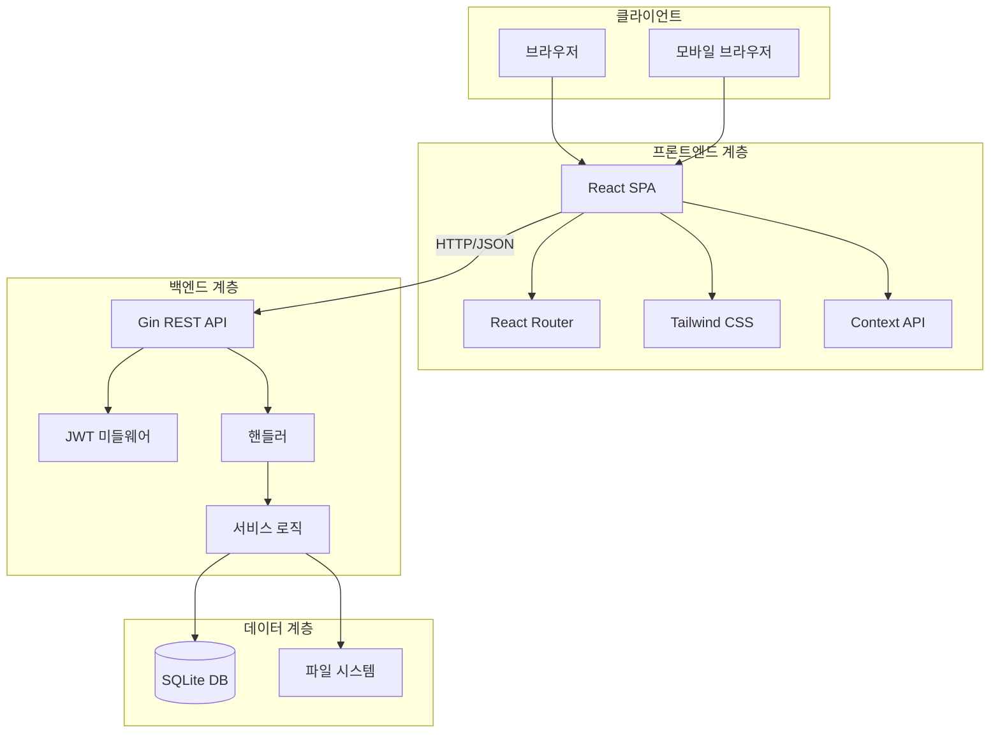

### 백엔드 아키텍처

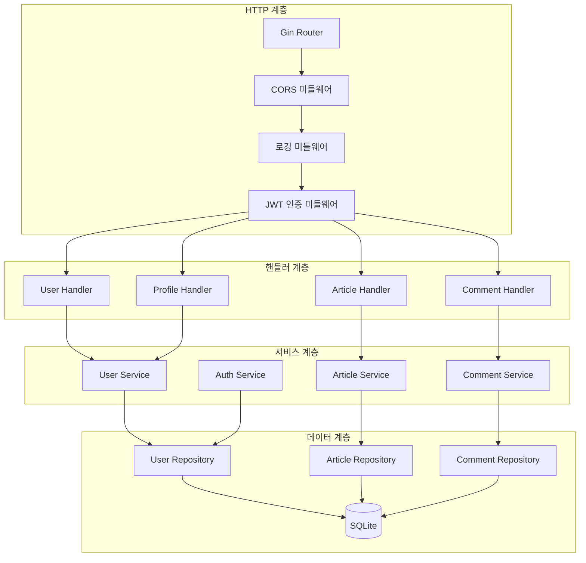

### 프론트엔드 아키텍처

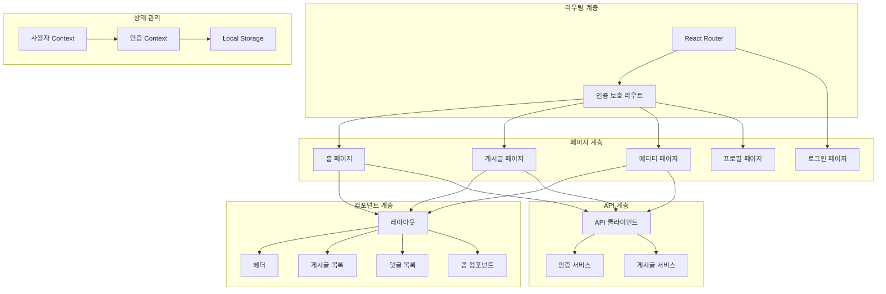

## 💾 데이터베이스 설계

### ERD (Entity Relationship Diagram)

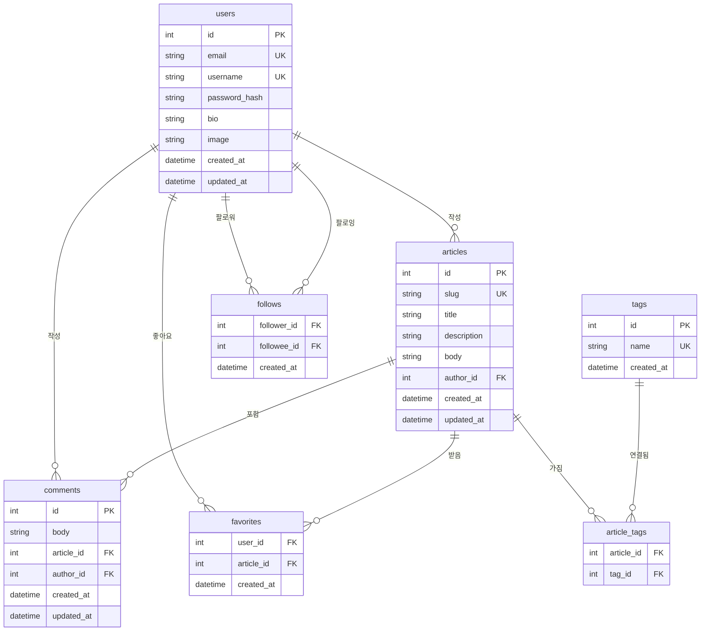

### 데이터베이스 스키마

#### Users 테이블
```sql
CREATE TABLE users (
    id INTEGER PRIMARY KEY AUTOINCREMENT,
    email VARCHAR(255) UNIQUE NOT NULL,
    username VARCHAR(255) UNIQUE NOT NULL,
    password_hash VARCHAR(255) NOT NULL,
    bio TEXT,
    image VARCHAR(500),
    created_at DATETIME DEFAULT CURRENT_TIMESTAMP,
    updated_at DATETIME DEFAULT CURRENT_TIMESTAMP
);
```

#### Articles 테이블
```sql
CREATE TABLE articles (
    id INTEGER PRIMARY KEY AUTOINCREMENT,
    slug VARCHAR(255) UNIQUE NOT NULL,
    title VARCHAR(255) NOT NULL,
    description TEXT NOT NULL,
    body TEXT NOT NULL,
    author_id INTEGER NOT NULL,
    created_at DATETIME DEFAULT CURRENT_TIMESTAMP,
    updated_at DATETIME DEFAULT CURRENT_TIMESTAMP,
    FOREIGN KEY (author_id) REFERENCES users(id) ON DELETE CASCADE
);
```

#### Comments 테이블
```sql
CREATE TABLE comments (
    id INTEGER PRIMARY KEY AUTOINCREMENT,
    body TEXT NOT NULL,
    article_id INTEGER NOT NULL,
    author_id INTEGER NOT NULL,
    created_at DATETIME DEFAULT CURRENT_TIMESTAMP,
    updated_at DATETIME DEFAULT CURRENT_TIMESTAMP,
    FOREIGN KEY (article_id) REFERENCES articles(id) ON DELETE CASCADE,
    FOREIGN KEY (author_id) REFERENCES users(id) ON DELETE CASCADE
);
```

## 🔌 API 설계

### API 엔드포인트 구조

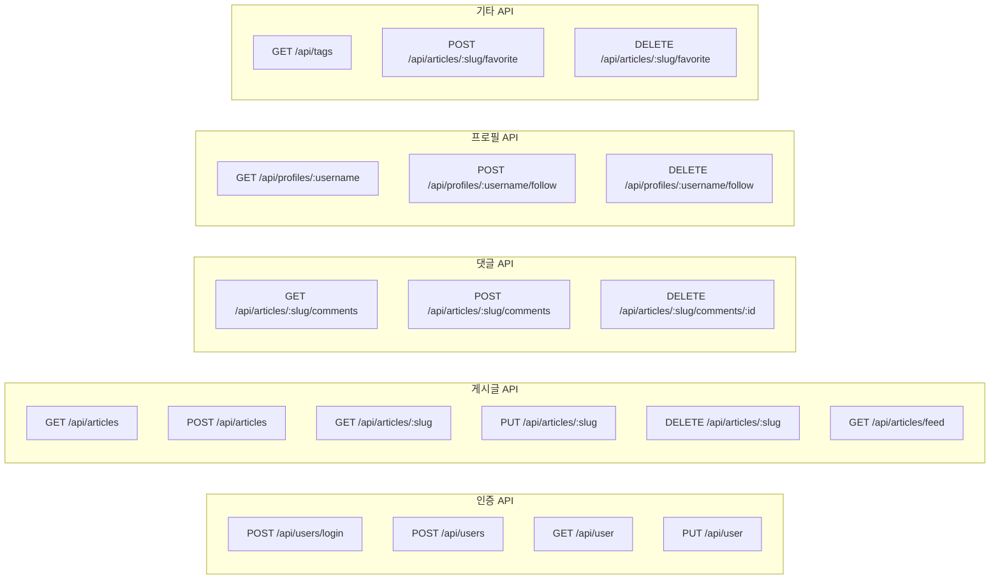

### 인증 플로우

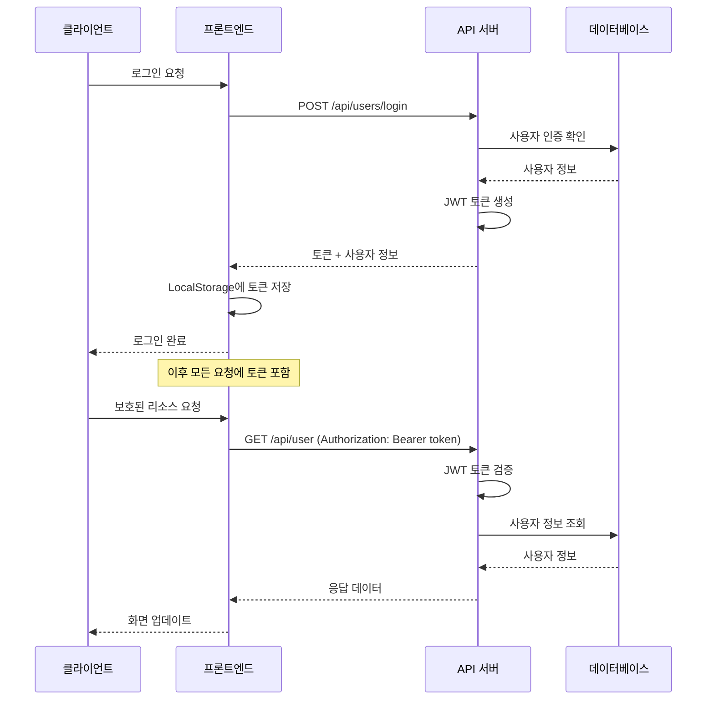

## 🎨 UI/UX 설계

### 페이지 플로우

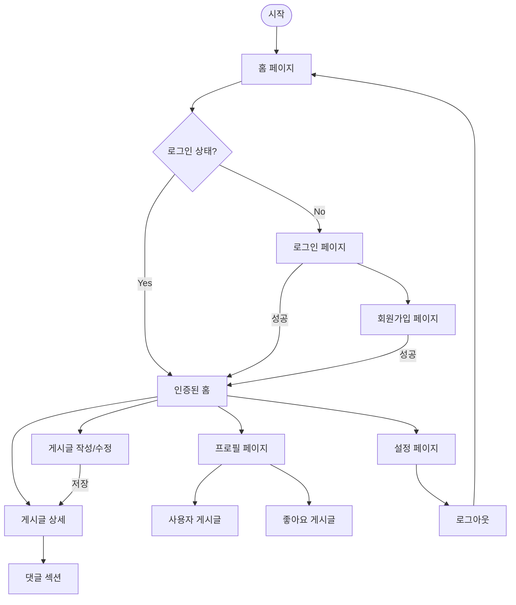

### 컴포넌트 계층 구조

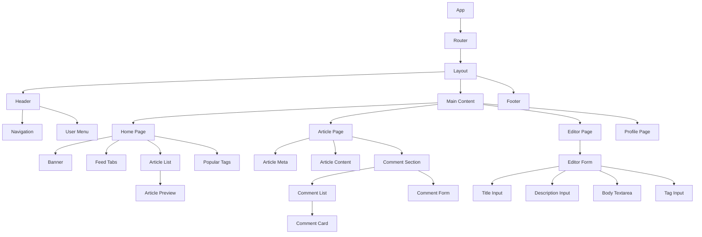

## 🔐 보안 설계

### 인증 및 인가

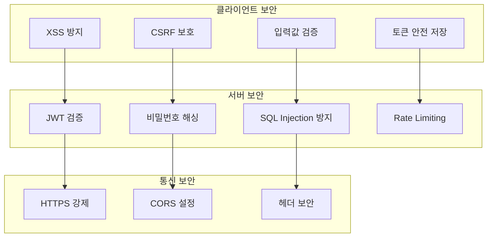

### 데이터 보안 정책

1. **비밀번호 보안**
   - bcrypt를 사용한 해싱 (최소 12 rounds)
   - 평문 비밀번호는 메모리에서 즉시 삭제

2. **JWT 토큰 관리**
   - 액세스 토큰 만료 시간: 24시간
   - 서명 알고리즘: HS256
   - 토큰 재발급은 로그인을 통해서만

3. **API 보안**
   - 모든 민감한 엔드포인트는 인증 필요
   - 사용자는 본인 데이터만 수정 가능
   - 관리자 권한은 별도 구현하지 않음 (MVP 범위 외)

## 📁 프로젝트 구조

### 백엔드 구조 (Go)

```
backend/
├── cmd/
│   └── main.go                 # 애플리케이션 엔트리포인트
├── internal/
│   ├── config/                 # 설정 관리
│   ├── handlers/               # HTTP 핸들러
│   │   ├── user.go
│   │   ├── article.go
│   │   └── comment.go
│   ├── middleware/             # 미들웨어
│   │   ├── auth.go
│   │   ├── cors.go
│   │   └── logger.go
│   ├── models/                 # 데이터 모델
│   ├── repository/             # 데이터 액세스 계층
│   ├── services/               # 비즈니스 로직
│   └── utils/                  # 유틸리티
├── pkg/                        # 외부 공용 패키지
├── migrations/                 # DB 마이그레이션
├── go.mod
└── go.sum
```

### 프론트엔드 구조 (React)

```
frontend/
├── public/
├── src/
│   ├── components/             # 재사용 컴포넌트
│   │   ├── common/
│   │   ├── forms/
│   │   └── ui/
│   ├── pages/                  # 페이지 컴포넌트
│   │   ├── Home/
│   │   ├── Article/
│   │   ├── Editor/
│   │   ├── Profile/
│   │   └── Auth/
│   ├── hooks/                  # 커스텀 훅
│   ├── services/               # API 서비스
│   ├── contexts/               # Context API
│   ├── utils/                  # 유틸리티
│   ├── styles/                 # 스타일
│   ├── App.jsx
│   └── main.jsx
├── package.json
└── vite.config.js
```

## 🚀 배포 아키텍처

### 개발 환경

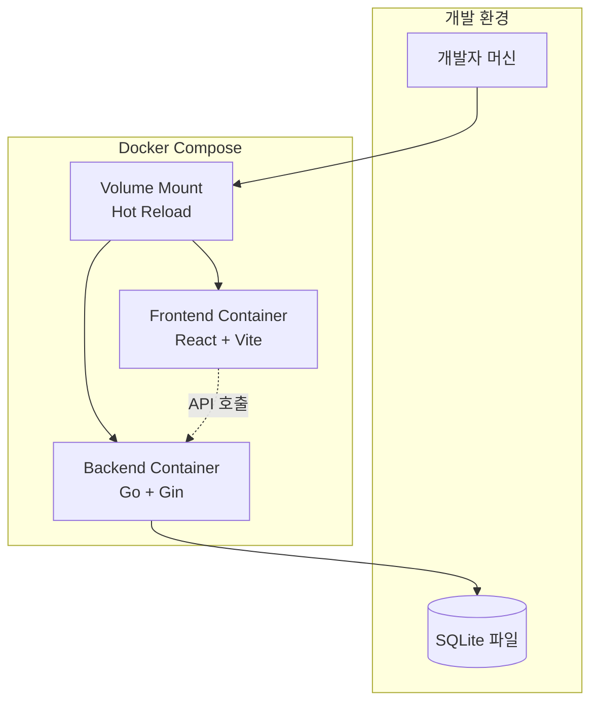

### 프로덕션 환경 (미래 확장)

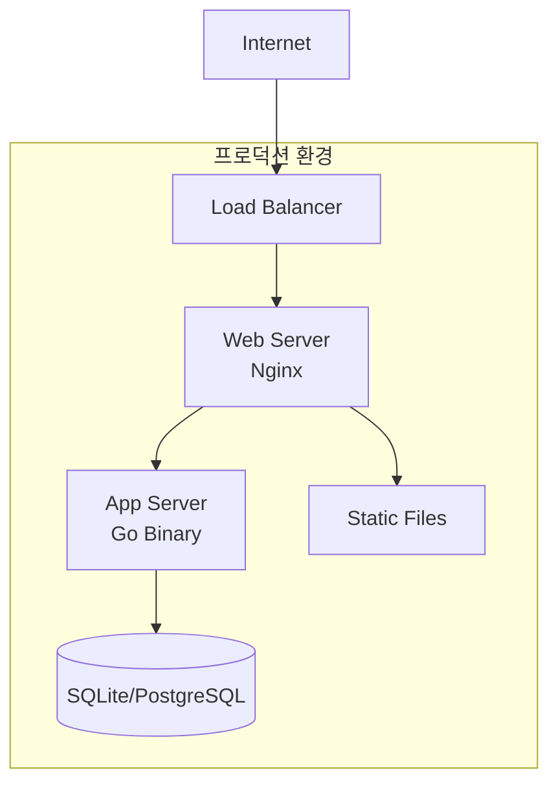

## 📊 성능 최적화 전략

### 백엔드 최적화
- **데이터베이스 인덱스**: 자주 조회되는 필드에 인덱스 생성
- **쿼리 최적화**: N+1 문제 방지, 조인 최적화
- **응답 캐싱**: 정적 데이터 메모리 캐시
- **동시성**: Go의 goroutine 활용

### 프론트엔드 최적화
- **코드 스플리팅**: 라우트별 lazy loading
- **메모이제이션**: React.memo, useMemo 활용
- **번들 최적화**: Vite의 트리 쉐이킹
- **이미지 최적화**: 적절한 형식과 크기 사용

## 🔄 개발 워크플로우

### Git 브랜치 전략

```mermaid
gitgraph
    commit id: "Initial"
    branch develop
    commit id: "Setup"
    branch feature/auth
    commit id: "Auth API"
    commit id: "Auth UI"
    checkout develop
    merge feature/auth
    branch feature/articles
    commit id: "Article CRUD"
    commit id: "Article UI"
    checkout develop
    merge feature/articles
    checkout main
    merge develop id: "Release v1.0"
```

### 개발 단계별 마일스톤

1. **Phase 1: 환경 구성** (1주)
   - 프로젝트 구조 생성
   - Docker 환경 설정
   - 기본 라우팅 구현

2. **Phase 2: 핵심 기능** (2주)
   - 사용자 인증 구현
   - 게시글 CRUD 구현
   - 기본 UI 구현

3. **Phase 3: 추가 기능** (1주)
   - 댓글 시스템
   - 좋아요 기능
   - 프로필 시스템

## 📚 기술 스택 선택 이유

### 백엔드 - Go + Gin
- **단순성**: 명확한 문법, 적은 추상화
- **성능**: 컴파일 언어의 빠른 실행 속도
- **동시성**: 내장된 goroutine 지원
- **생태계**: 안정적이고 변화가 적은 라이브러리

### 프론트엔드 - React + Vite
- **학습 곡선**: 널리 사용되는 프레임워크
- **개발 경험**: Vite의 빠른 개발 서버
- **생태계**: 풍부한 라이브러리와 도구
- **취업 시장**: 높은 수요와 활용도

### 데이터베이스 - SQLite
- **단순성**: 파일 기반, 별도 서버 불필요
- **이식성**: 개발부터 배포까지 동일 환경
- **학습 용이성**: 복잡한 설정 없이 SQL 학습 가능
- **MVP 적합성**: 소규모 애플리케이션에 최적

---

이 설계 문서는 바이브 코딩 실습의 효율적인 학습을 위해 작성되었으며, 실제 구현 과정에서 필요에 따라 조정될 수 있습니다.